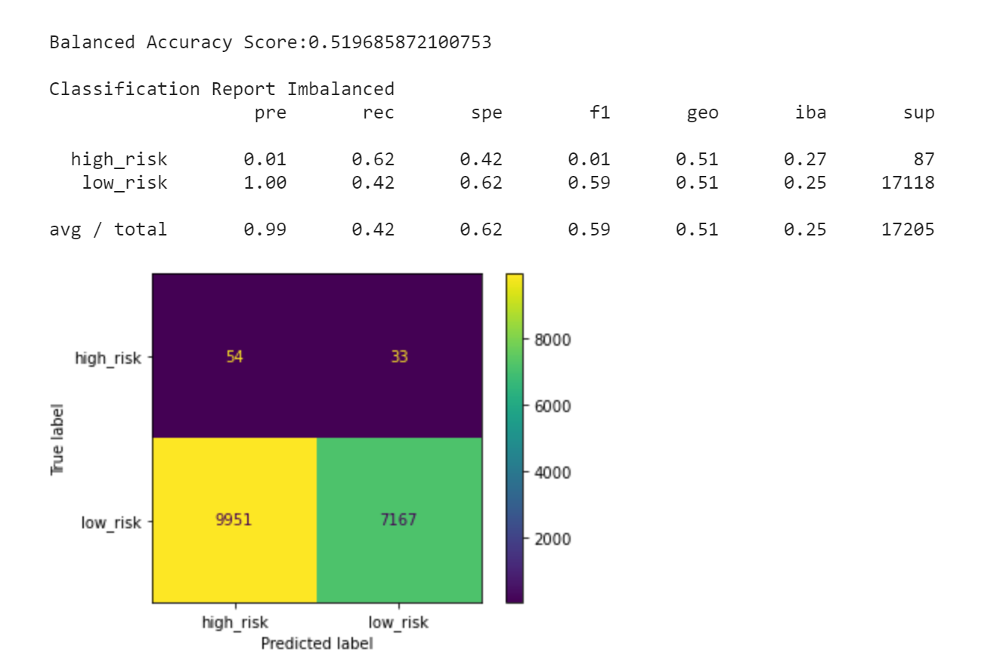
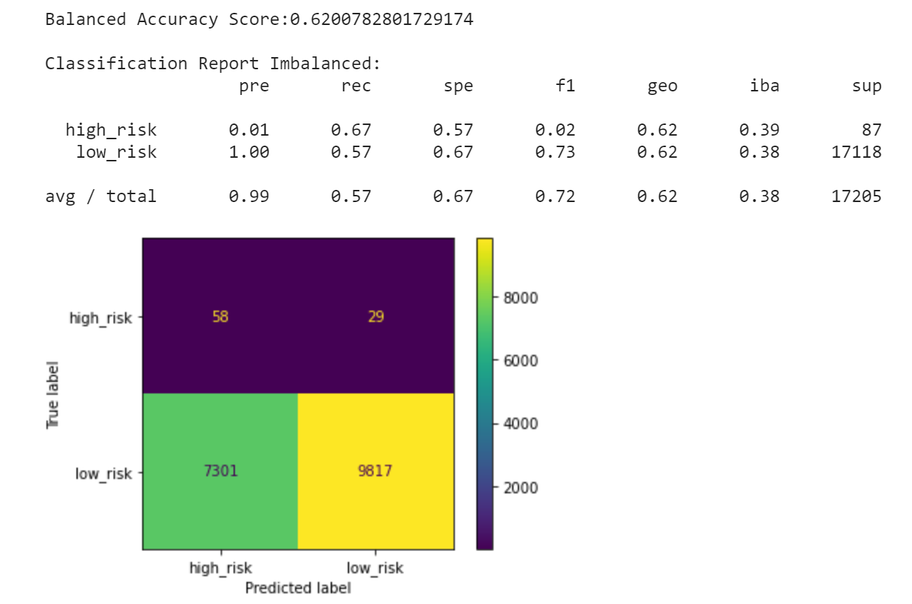

## Background

Auto loans, mortgages, student loans, debt consolidation ... these are just a few examples of credit and loans that people are seeking online. Peer-to-peer lending services such as LendingClub or Prosper allow investors to loan other people money without the use of a bank. However, investors always want to mitigate risk, so you have been asked by a client to help them use machine learning techniques to predict credit risk.

I had build and evaluate several machine-learning models to predict credit risk using free data from LendingClub. Credit risk is an inherently imbalanced classification problem (the number of good loans is much larger than the number of at-risk loans), so I need to employ different techniques for training and evaluating models with imbalanced classes. I used the imbalanced-learn and Scikit-learn libraries to build and evaluate models using the two following techniques:

1. [Resampling](#Resampling)
2. [Ensemble Learning](#Ensemble-Learning)

- - -

### Files

[Resampling  Notebook](Notebooks/credit_risk_resampling.ipynb)

[Ensemble  Notebook](Notebooks/credit_risk_ensemble.ipynb)

[Lending Club Loans Data](Instructions/Resources/LoanStats_2019Q1.csv.zip)

- - -

#### Resampling

I had used the [imbalanced learn](https://imbalanced-learn.readthedocs.io) library to resample the LendingClub data and build and evaluate logistic regression classifiers using the resampled data.

Completed steps:

1. Oversample the data using the `Naive Random Oversampler` and `SMOTE` algorithms.
2. Undersample the data using the `Cluster Centroids` algorithm.
3. Over- and under-sample using a combination `SMOTEENN` algorithm.

Completed steps I follow for each model:

1. Train a `logistic regression classifier` from `sklearn.linear_model` using the resampled data.
2. Calculate the `balanced accuracy score` from `sklearn.metrics`.
3. Calculate the `confusion matrix` from `sklearn.metrics`.
4. Print the `imbalanced classification report` from `imblearn.metrics`.

## `Naive Random Oversampler`

## `SMOTE` algorithm

## `Cluster Centroids` algorithm 

## `SMOTEENN` algorithm.

### Based on the information above:
* The Logistic Regression Classifier model had the best balanced accuracy score of 0.647 by oversample the data using the SMOTE algorithm.

* The Logistic Regression Classifier model had the best average recall score of .68 by oversample the data using the "Naive Random Oversampler".

* The Logistic Regression Classifier model had the best average geometric mean score of 0.65 by oversample the data using the "SMOTE algorithm".

#### Ensemble Learning

In this section, I will train and compare two different ensemble classifiers to predict loan risk and evaluate each model. You will use the `balanced random forest classifier` and the `easy ensemble classifier`.

Completed steps I follow for each model:

1. Train the model using the quarterly data from LendingClub provided in the `Resource` folder.
2. Calculate the balanced accuracy score from `sklearn.metrics`.
3. Print the confusion matrix from `sklearn.metrics`.
4. Generate a classification report using the `imbalanced_classification_report` from imbalanced learn.
5. For the balanced random forest classifier only, print the feature importance sorted in descending order (most important feature to least important) along with the feature score.

## `balanced random forest classifier`

## `easy ensemble classifier`

### Based on the information above:

* Easy ensemble classifier model had the best balanced accuracy score of 0.925

* Easy ensemble classifier model had the best recall score of 0.94

* Easy ensemble classifier model had the best recall score of 0.93

* 'total_rec_prncp', 'total_rec_int', 'total_pymnt_inv' are the top 3 features for Balanced Random Forest Classifier
- - -

For the ensemble learners, 100 estimators were used for both models.

- - -

